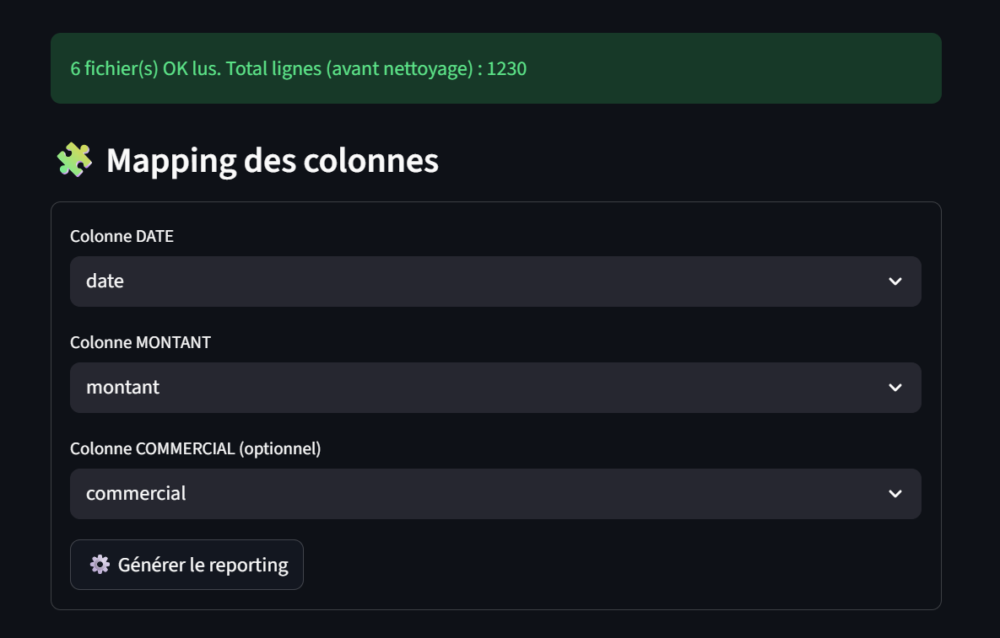

# 📊 Reporting Automatisé PME


Outil automatisé de consolidation et reporting Excel pour PME.

Objectif : transformer des exports Excel bruts en reporting exploitable, propre et traçable, en quelques secondes.

---

# 🎯 Problématique PME

De nombreuses PME :

- Consolident manuellement plusieurs exports Excel
- Refont les mêmes manipulations chaque mois
- Perdent du temps sur le nettoyage des données
- Manquent de traçabilité en cas d’erreur
- N’ont pas d’outil simple pour produire un reporting clair

Cette solution automatise l’ensemble du processus.

---

# ✅ Fonctionnalités

✔ Consolidation automatique de multiples fichiers Excel  
✔ Nettoyage et normalisation des données  
✔ Détection d’erreurs (dates invalides, montants incorrects)  
✔ Reporting mensuel  
✔ Reporting par commercial  
✔ Export Excel multi-feuilles  
✔ Génération PDF  
✔ Log d’exécution détaillé (audit & traçabilité)  
✔ Empreinte SHA256 des fichiers source  

⚠️ Remarque : Cette démo est conçue pour fonctionner avec des fichiers Excel respectant le format généré par le programme de génération de fichiers de démonstration introduit plus bas. Les fichiers doivent avoir les colonnes attendues (date, montant, commercial, etc.) et un format compatible .xlsx.

---

# 📦 Prérequis d'installation

- Ordinateur Windows (code adaptable à MacOS et Linux avec quelques changements)
- Python 3.10+ installé
- Option “Add Python to PATH” cochée
- Droits d’installation initiaux (ou intervention IT)
- Connexion Internet uniquement lors de la première installation

---

# 🧪 Données de démonstration

Pour tester le projet :

```bash
python generate_demo_data.py
```

Cela crée automatiquement plusieurs fichiers Excel simulés dans :

data/

---

# 🚀 Modes de fonctionnement

## 1️⃣ Mode Batch (automatisation locale)

Lecture automatique des fichiers déposés dans (dossier à créer) :

data/

Génération des résultats dans :

output/&lt;ANNEE&gt;/

Fichiers produits :

- reporting_YYYY-MM_to_YYYY-MM.xlsx
- rapport_YYYY-MM_to_YYYY-MM.pdf
- log_YYYY-MM-DD.txt

### Lancer :

```bash
python main.py
```

Idéal pour :

Exécution planifiée via le planificateur de tâches

Traitement mensuel

Intégration dans un flux interne

---

## 2️⃣ Interface Web (Streamlit)

Interface utilisateur interactive :

Upload des fichiers Excel

Mapping des colonnes

Contrôle qualité en temps réel

Génération instantanée

Téléchargement Excel / PDF / Log

Lancer :

```bash
streamlit run app.py
```

Idéal pour :

Utilisateur non technique

Traitement ponctuel

Analyse exploratoire

---

# 🖥 Aperçu de l’interface

## 1️⃣ Upload des fichiers Excel


Interface permettant l’import de plusieurs fichiers `.xlsx` simultanément, avec détection automatique des doublons.

---

## 2️⃣ Mapping des colonnes



Sélection guidée des colonnes nécessaires (Date, Montant, Commercial) avec validation des incohérences.

---

## 3️⃣ Résumé & Reporting


Affichage des indicateurs clés :

- Nombre de fichiers traités  
- Lignes avant/après nettoyage  
- Qualité des données  
- Chiffre d’affaires total  
- Reporting mensuel et par commercial  

---

## 4️⃣ Téléchargement des résultats


Export immédiat :

- Excel multi-feuilles formaté  
- Rapport PDF  
- Log d’exécution complet (audit & traçabilité)  

---

# 🏗 Architecture du projet

```
project/
│
├── app.py
├── main.py
├── utils.py
├── generate_demo_data.py
├── requirements.txt
├── README.md
│
├── data/      # Fichiers source (non versionnés)
├── output/    # Résultats générés (non versionnés)
└── venv/      # Environnement virtuel (non versionné)
```

# ⚙ Installation

1️⃣ Créer un environnement virtuel

```bash
python -m venv venv
```

Activation (Windows) :

```bash
venv\Scripts\activate
```

Si PowerShell bloque :

```bash
Set-ExecutionPolicy -Scope CurrentUser -ExecutionPolicy RemoteSigned
```

2️⃣ Installer les dépendances

```bash
pip install -r requirements.txt
```

---

## ⚙️ Installation & Lancement simplifiés (.bat)

Pour une utilisation simple côté PME, l’outil peut être installé et lancé sans utiliser le terminal.

### 🔹 Installation (une seule fois)
.
Double-cliquer sur `INSTALLER.bat`.

Ce script :
- Crée un environnement virtuel (venv)
- Installe automatiquement les dépendances
- Prépare l’environnement d’exécution

---

### 🔹 Lancement – Mode Interface (recommandé)

Double-cliquer sur :

`RUN_STREAMLIT.bat`

Cela :
- Active l’environnement virtuel
- Lance l’application Streamlit
- Ouvre automatiquement le navigateur en local (localhost)

---

### 🔹 Lancement – Mode Batch (automatique)

1. Déposer les fichiers Excel dans le dossier `data/`
2. Double-cliquer sur `RUN_BATCH.bat`

Le script :
- Traite automatiquement tous les fichiers `.xlsx`
- Génère les reportings dans `output/`
- Produit un fichier log horodaté

⚠ En environnement planifié (Planificateur de tâches Windows), le fichier `RUN_BATCH.bat` peut être exécuté automatiquement à une fréquence définie en modifiant légèrement le fichier comme décrit dedans (mensuelle, hebdomadaire, etc.).


# 🧾 Traçabilité & Audit

Chaque exécution enregistre :

Horodatage précis

Liste des fichiers traités

Hash SHA256 des fichiers

Statistiques de qualité des données

Nombre de lignes supprimées

Résumé financier

Objectif : pouvoir justifier un résultat à tout moment.

---

# 🔐 Sécurité & Bonnes pratiques

Aucun code client n’est exécuté

Validation des types et conversions sécurisées

Gestion robuste des erreurs

Données non versionnées

Logs exploitables en cas de contrôle

---

# 💼 Cas d’usage

Consolidation mensuelle des ventes

Reporting commercial multi-fichiers

Préparation reporting expert-comptable

Vérification cohérence exports CRM

Analyse interne direction

---

# 📈 Valeur ajoutée

Gain estimé :

1 à 3 heures économisées par mois

Réduction du risque d’erreur humaine

Meilleure traçabilité

Standardisation du reporting

---

# 🧠 Technologies

Python 3.10+

Pandas

OpenPyXL

ReportLab

Streamlit

Git

---

# 👨‍💻 Auteur

Vivien Gauzelin  
Ingénieur – Automatisation de données pour PME  

Projet démonstration dans le cadre d’une activité freelance spécialisée en automatisation de processus et reporting.
